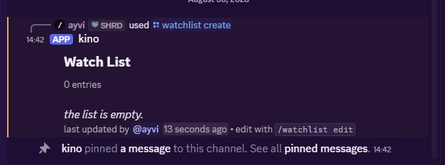
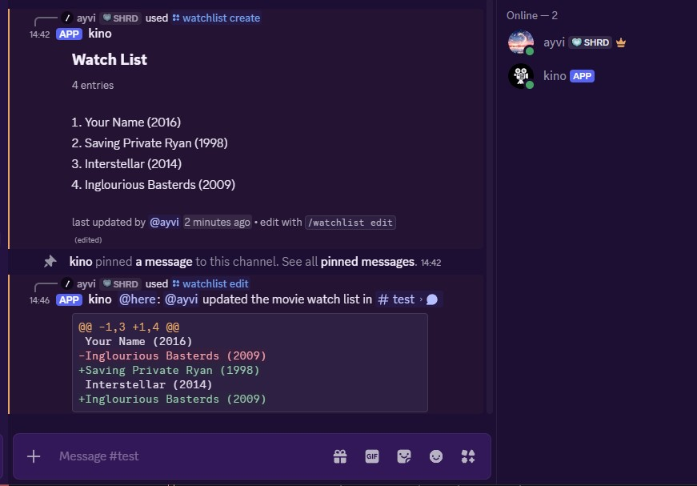

# kino

This is a simple discord bot to share a collaborative list for our movie club.

Turns out Letterboxd doesn't already have this feature, and I refuse to willingly add another google/excel sheet into my life.

Built using [poise](https://github.com/serenity-rs/poise/)/[serenity](https://github.com/serenity-rs/serenity) and deployed on GCP [Compute Engine](https://cloud.google.com/products/compute).

2 cargo features exist for configuring the backend to use either [Postgres](https://www.postgresql.org/) _(default)_, or [SQLite](https://sqlite.org/).

### Name

The name 'kino' was taken from the name of the operation in Inglourious Basterds, which comes from the German word for 'cinema' or 'movie theatre'. Plus I thought it sounded cool.

---

> [!NOTE]
> This project was mostly an experiment with building discord bots in rust. \
> All this bot currently does is allow users to edit the same pinned message, and just served as a quick way to share an editable list. \
> Do not expect full features or continuous updates.

## Usage

Run `/watchlist create` to create a new pinned message in the current channel for a list. There is only 1 list per channel (and currently no way to delete it).

<!--  -->

Run `/watchlist edit` to edit the pinned message. Each line is a new entry, and after any edit the resulting diff is posted as a message to the channel.

<!--  -->

Run `/watchlist clear` to remove all existing entries.

_More features planned._

### Limitations

Discord has a hard cap on characters in a single message at 2000 characters, which isn't likely unless the list hits 100+ titles. If this ever becomes an issue, I'd probably use another medium other than text input.
